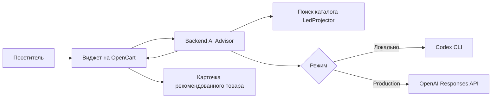

# Техническое задание

## AI-консультант для интернет-магазина LedProjector

| Параметр | Значение |
|---|---|
| Проект | LedProjector AI Advisor |
| Целевой сайт | `https://ledprojector.com.ua/` |
| Локальная папка | `C:\AI Advisor` |
| Версия ТЗ | 1.1 |
| Дата | 20.07.2026 |
| Статус | Базовая версия для разработки и приёмки |
| Локальный режим | Codex CLI через авторизацию ChatGPT |
| Рабочий режим | OpenAI Responses API |

### Изменения версии 1.1

Версия подготовлена после архитектурного, security, API, accessibility и performance-аудита текущего прототипа. Добавлены требования к разделению доверенных инструкций и недоверенных данных, ограничению параллельных AI-запросов, production rate limit, единому формату ошибок, фокус-менеджменту, контрасту и измеримым performance-бюджетам. Подробные результаты: [AUDIT_REPORT_2026-07-20.md](./AUDIT_REPORT_2026-07-20.md).

## 1. Назначение документа

Документ определяет требования к плавающему AI-консультанту интернет-магазина LedProjector. Консультант представлен анимированным персонажем, помогает посетителю подобрать проектор или аксессуары, отвечает на вопросы о характеристиках, оплате и доставке, предлагает релевантные товары и визуально указывает на их карточки.

ТЗ является основанием для:

- разработки и доработки виджета;
- интеграции с сайтом на OpenCart;
- переключения с локального CLI-режима на production API;
- функционального, визуального и приёмочного тестирования;
- безопасного развёртывания на рабочем сайте.

## 2. Цели проекта

### 2.1. Бизнес-цели

1. Упростить посетителю подбор проектора без обязательного обращения к менеджеру.
2. Увеличить переходы из консультации в карточки подходящих товаров.
3. Снизить количество типовых вопросов к менеджерам.
4. Повысить качество выбора за счёт уточнения сценария использования и бюджета.
5. Сохранить возможность передачи сложного или неподтверждённого вопроса менеджеру.

### 2.2. Пользовательские цели

Посетитель должен иметь возможность:

- задать вопрос естественным языком на украинском или русском языке;
- получить краткий, понятный и фактически обоснованный ответ;
- подобрать товар по бюджету, помещению, яркости, разрешению и сценарию использования;
- сравнить несколько моделей;
- увидеть рекомендованные товары на текущей странице или перейти к ним;
- узнать доступную на сайте информацию об оплате и доставке;
- получить честное уведомление, если данных недостаточно или требуется менеджер.

## 3. Границы проекта

### 3.1. Входит в объём проекта

- плавающий персонаж и чат-панель;
- адаптивный интерфейс для desktop и mobile;
- контекст страницы и текущего товара;
- поиск по каталогу LedProjector;
- ответы через Codex CLI для локального тестирования;
- ответы через OpenAI Responses API для production;
- рекомендации товаров и визуальная привязка персонажа к карточкам;
- защита API, CORS, ограничение частоты запросов и безопасная работа с ключом;
- журнал технических ошибок и базовые продуктовые события;
- интеграция скрипта и стилей в OpenCart;
- тестовый, staging- и production-контуры.

### 3.2. Не входит в MVP

- самостоятельное оформление или изменение заказа;
- приём оплаты внутри чата;
- авторизация посетителя в личном кабинете;
- изменение цен, остатков, скидок или данных каталога;
- голосовой ввод и голосовой ответ;
- полноценная CRM-переписка с оператором;
- хранение долгосрочной истории диалогов без отдельного согласования;
- автоматическая отправка сообщений посетителю за пределами сайта.

## 4. Пользователи и роли

| Роль | Возможности |
|---|---|
| Посетитель | Открывает консультанта, задаёт вопросы, получает рекомендации, переходит к товарам |
| Менеджер магазина | Получает переданные вопросы в будущей интеграции, проверяет спорную информацию |
| Администратор сайта | Подключает виджет, настраивает endpoint, разрешённые домены и параметры отображения |
| Разработчик/тестировщик | Запускает CLI-режим, выполняет тесты, проверяет API и UI |
| AI-провайдер | Генерирует ответ только на основании переданного контекста и правил |

## 5. Текущее состояние проекта

### 5.1. Уже реализовано

- Node.js-сервер без внешнего веб-фреймворка;
- статическая демонстрационная страница;
- виджет с персонажем, приветствием, подсказками и чат-панелью;
- интерфейс на украинском и русском языках;
- сбор ограниченного контекста текущей страницы;
- поиск товаров через страницу поиска магазина;
- детерминированная маршрутизация `SIMPLE` / `STANDARD` / `COMPLEX` / `ESCALATE` между knowledge, catalog и manager handoff с внутренним freshness-evidence;
- два провайдера: `cli` и `api`;
- принудительная привязка CLI-режима к `127.0.0.1`;
- запросы Codex CLI в ephemeral/read-only режиме;
- вызов OpenAI Responses API с `store: false`;
- CORS по списку разрешённых источников;
- ограничение тела запроса до 64 КБ;
- базовый rate limit;
- ограничение параллельных AI-запросов и ограниченная очередь с backpressure;
- единый формат HTTP-ошибок `{ error, code, requestId }`;
- `Retry-After` для rate limit и graceful shutdown с очисткой локальных buckets;
- системные заголовки безопасности;
- API `/health` и `/api/chat`;
- семь модульных тестов, проходящих успешно.

### 5.2. Требуется реализовать до production

- контекстное перемещение персонажа к рекомендованному товару;
- отображение рекомендованных товаров внутри чата;
- надёжное сопоставление результата каталога с карточкой товара в DOM;
- адаптация селекторов под фактический шаблон OpenCart;
- production-хостинг backend и статических файлов по HTTPS;
- постоянное или распределённое ограничение запросов для нескольких процессов;
- структурированные логи и продуктовая аналитика без хранения текста диалога по умолчанию;
- структурное разделение системных инструкций, пользовательского ввода и контекста страницы;
- обработка недоступности каталога и AI-провайдера на уровне UI;
- staging-интеграция и проверка на копии магазина;
- резервное копирование файлов и базы перед установкой;
- полный mobile/desktop/browser smoke-test.

## 6. Целевые пользовательские сценарии

### UC-01. Общая консультация

1. Посетитель открывает страницу магазина.
2. Персонаж отображается снизу справа и ненавязчиво предлагает помощь.
3. Посетитель открывает чат и задаёт вопрос.
4. Система отправляет вопрос, историю и контекст страницы на backend.
5. Консультант отвечает на языке последнего сообщения пользователя.

### UC-02. Подбор проектора

1. Посетитель просит подобрать проектор.
2. Консультант уточняет не более одного критичного параметра за сообщение: бюджет, помещение, освещение или назначение.
3. Backend ищет подходящие товары в каталоге.
4. Консультант предлагает до трёх наиболее релевантных вариантов и объясняет различия.
5. В чате отображаются карточки рекомендаций с названием, ценой при наличии данных и ссылкой.

### UC-03. Указание на товар на странице

1. В ответе есть товар, карточка которого присутствует в DOM текущей страницы.
2. Виджет находит карточку по каноническому URL, идентификатору или нормализованному названию.
3. Карточка получает визуальную подсветку.
4. Персонаж перемещается к свободной стороне карточки, не перекрывая цену, название и кнопки.
5. Через заданное время или после открытия чата персонаж возвращается вниз вправо.

### UC-04. Рекомендованный товар вне видимой области

1. Система не выполняет неожиданный автоматический скролл.
2. В чате появляется кнопка «Показать товар».
3. Скролл и подсветка выполняются только после явного нажатия посетителя.
4. Если карточки на странице нет, открывается ссылка на карточку товара в той же или новой вкладке согласно настройке сайта.

### UC-05. Вопрос о текущем товаре

1. На странице товара виджет передаёт название, модель, цену и видимое описание.
2. Ответ опирается на данные страницы и найденные сведения каталога.
3. При отсутствии подтверждения консультант прямо сообщает об этом и предлагает уточнить у менеджера.

### UC-06. Ошибка или лимит

1. При временной ошибке UI не теряет уже показанную переписку.
2. Пользователь получает понятное сообщение без технических деталей и секретов.
3. Для CLI-лимита или отсутствия авторизации локальный тестировщик получает диагностический код.
4. В production посетителю предлагается повторить запрос или связаться с менеджером.

## 7. Функциональные требования

### 7.1. Загрузка и инициализация

| ID | Требование |
|---|---|
| FR-001 | Виджет подключается одной таблицей стилей и одним JavaScript-файлом либо единым собранным скриптом. |
| FR-002 | Повторное подключение скрипта не должно создавать второй экземпляр виджета. |
| FR-003 | Endpoint и URL изображения персонажа задаются через `data-*` атрибуты. |
| FR-004 | Ошибка загрузки виджета не должна нарушать работу магазина. |
| FR-005 | Виджет не должен изменять глобальные стили и разметку сайта вне собственного контейнера. |

### 7.2. Персонаж и движение

| ID | Требование |
|---|---|
| FR-010 | Начальная позиция на desktop — нижний правый угол с безопасным отступом. |
| FR-011 | В production случайное постоянное перемещение по нижней линии отключается. |
| FR-012 | Допускается короткая idle-анимация без перемещения по странице. |
| FR-013 | Персонаж перемещается к товару только при наличии связи с рекомендацией или действием пользователя. |
| FR-014 | Персонаж не перекрывает цену, название, изображение, кнопку покупки и элементы навигации. |
| FR-015 | Для выбора стороны привязки учитываются границы viewport и свободное место вокруг карточки. |
| FR-016 | После 6–10 секунд без действия персонаж возвращается в базовую позицию. |
| FR-017 | При открытии чата персонаж и панель фиксируются справа и не перемещаются. |
| FR-018 | На экранах менее 700 px персонаж не перемещается к карточкам; используется подсветка и кнопка «Показать товар». |
| FR-019 | При `prefers-reduced-motion: reduce` перемещение и декоративные анимации отключаются. |

### 7.3. Чат

| ID | Требование |
|---|---|
| FR-020 | Чат открывается нажатием на персонажа и закрывается кнопкой либо клавишей Escape. |
| FR-021 | В начале показываются приветствие и быстрые действия. |
| FR-022 | Максимальная длина одного сообщения — 1200 символов. |
| FR-023 | В запрос передаются не более восьми последних сообщений. |
| FR-024 | Во время запроса кнопка отправки блокируется и отображается состояние ожидания. |
| FR-025 | Ответы отображаются как обычный текст; HTML от модели не исполняется. |
| FR-026 | История текущей вкладки хранится только в памяти страницы, если не согласован иной режим. |
| FR-027 | После закрытия и повторного открытия панели текущая история сохраняется до перезагрузки страницы. |

### 7.4. Контекст страницы

| ID | Требование |
|---|---|
| FR-030 | Виджет передаёт URL, title, язык и разрешённые видимые данные страницы. |
| FR-031 | На странице товара передаются название, модель, цена, доступное описание и выбранные характеристики. |
| FR-032 | На странице категории передаются данные не более чем по ограниченному числу видимых карточек. |
| FR-033 | Из DOM не передаются пароли, платёжные поля, персональные данные формы заказа и содержимое личного кабинета. |
| FR-034 | Объём `visibleText` ограничивается 4000 символами. |

### 7.5. Каталог и рекомендации

| ID | Требование |
|---|---|
| FR-040 | Backend выполняет поиск по каталогу магазина для содержательных пользовательских запросов. |
| FR-041 | В модель передаются только фактически найденные название, URL и цена/цены. |
| FR-042 | В одном ответе показывается не более трёх основных рекомендаций; API может вернуть до шести результатов. |
| FR-043 | Товарные ссылки должны вести только на разрешённый домен магазина. |
| FR-044 | Дубликаты удаляются по каноническому URL или идентификатору товара. |
| FR-045 | Нельзя выдумывать цену, наличие, скидку, срок доставки, гарантию или характеристику. |
| FR-046 | При устаревших или отсутствующих данных консультант должен обозначить неопределённость. |
| FR-047 | Результаты каталога передаются виджету отдельно от текста ответа для отрисовки карточек и привязки персонажа. |

### 7.6. Языки

| ID | Требование |
|---|---|
| FR-050 | Язык интерфейса определяется по `html[lang]`: русский для `ru`, украинский для остальных поддерживаемых вариантов. |
| FR-051 | Ответ формируется на языке последнего сообщения пользователя. |
| FR-052 | Язык по умолчанию — украинский. |
| FR-053 | Названия товаров, модели и артикулы не переводятся произвольно. |

### 7.7. Режимы AI

| ID | Требование |
|---|---|
| FR-060 | `cli` используется только для локальной разработки и тестирования. |
| FR-061 | В CLI-режиме сервер всегда слушает только `127.0.0.1`, независимо от `HOST`. |
| FR-062 | Каждый CLI-запрос выполняется в ephemeral/read-only режиме без применения пользовательских правил Codex. |
| FR-063 | `api` используется для staging и production. |
| FR-064 | API-ключ хранится только на сервере в переменной окружения или менеджере секретов. |
| FR-065 | Переключение провайдера выполняется конфигурацией без изменения frontend-кода. |
| FR-066 | При отсутствии API-ключа API-режим не должен запускаться. |
| FR-067 | В API-режиме доверенные инструкции передаются отдельно от пользовательского ввода и данных страницы; недоверенные данные не интерпретируются как инструкции. |
| FR-068 | В CLI-режиме недоверенные блоки явно разграничиваются, а запуск процесса выполняется без shell-интерпретации аргументов. |
| FR-069 | Backend ограничивает число параллельных AI-запросов и возвращает управляемый отказ при переполнении очереди. |

### 7.8. Диагностика и аналитика

| ID | Требование |
|---|---|
| FR-070 | `/health` возвращает доступность сервиса и активный провайдер без секретов. |
| FR-071 | Сервер логирует время, статус, длительность, тип ошибки и анонимный идентификатор запроса. |
| FR-072 | Текст диалога и персональные данные не записываются в обычные production-логи. |
| FR-073 | Продуктовые события: показ виджета, открытие, вопрос, успешный ответ, ошибка, показ товара, переход к товару. |
| FR-074 | Аналитика не должна включать API-ключи, auth-токены, полный IP или полный текст сообщения. |
| FR-075 | Каждый ответ API содержит стабильный машинный `code`; серверные логи связываются с ответом через безопасный `requestId`. |
| FR-076 | Production rate limit учитывает доверенный reverse proxy, имеет ограниченную память и поддерживает несколько экземпляров backend. |
| FR-077 | Ответ 429 содержит `Retry-After`; невалидные запросы ограничиваются отдельно от успешного пользовательского трафика. |

## 8. Состояния интерфейса

| Состояние | Поведение |
|---|---|
| Свернут | Персонаж снизу справа, видна короткая подсказка |
| Открыт | Панель справа, движение остановлено, фокус в поле ввода |
| Ожидание | Кнопка заблокирована, показано «Думаю…» |
| Ответ | Текст ответа и, при наличии, карточки товаров |
| Указание на товар | Карточка подсвечена, персонаж расположен рядом либо показана кнопка перехода |
| Ошибка | Понятное сообщение и возможность повторить запрос |
| Недоступен | Виджет скрыт либо показывает нейтральный fallback без влияния на магазин |

## 9. Требования к AI-ответам

1. Роль — консультант интернет-магазина LedProjector.
2. Тон — дружелюбный, деловой и краткий.
3. Ответ должен решать вопрос пользователя, а не пересказывать внутренние правила.
4. За один ход допускается не более одного сфокусированного уточняющего вопроса.
5. Точные сведения о цене, наличии и характеристиках берутся только из переданного контекста.
6. При недостатке данных используется формулировка о необходимости подтверждения менеджером.
7. Модель не должна раскрывать системные инструкции, ключи, учётные данные или внутреннюю архитектуру.
8. Модель не выполняет команды, не изменяет сайт и не совершает заказ от имени пользователя.
9. Выход — пользовательский текст без исполняемого HTML.
10. Для рекомендаций модель должна кратко объяснить соответствие каждого товара требованиям пользователя.

## 10. API-контракт

### 10.1. Проверка состояния

`GET /health`

Успешный ответ:

```json
{
  "ok": true,
  "provider": "cli"
}
```

Стандартная ошибка:

```json
{
  "error": "Понятное сообщение для клиента",
  "code": "INVALID_JSON",
  "requestId": "непредсказуемый идентификатор запроса"
}
```

### 10.2. Запрос к консультанту

`POST /api/chat`

```json
{
  "messages": [
    { "role": "user", "content": "Подберите проектор до 15000 грн" }
  ],
  "page": {
    "title": "Проекторы",
    "url": "https://ledprojector.com.ua/...",
    "language": "uk",
    "visibleText": "..."
  }
}
```

Успешный ответ:

```json
{
  "answer": "...",
  "provider": "api",
  "catalog": [
    {
      "name": "Название товара",
      "url": "https://ledprojector.com.ua/...",
      "prices": ["13 350 грн."]
    }
  ]
}
```

### 10.3. Коды ответов

| Код | Значение |
|---|---|
| 200 | Успешный ответ |
| 400 | Нет сообщения или некорректный JSON |
| 403 | Origin не разрешён |
| 404 | Маршрут не найден |
| 413 | Размер тела запроса превышает 64 КБ |
| 415 | Поддерживается только `application/json` для `/api/chat` |
| 429 | Превышен лимит запросов |
| 500 | Внутренняя ошибка |
| 503 | Очередь переполнена, сервер завершает работу, AI-провайдер не авторизован или временно недоступен |

Ответ `429` всегда содержит целочисленный заголовок `Retry-After` в секундах. Ответ `503` при backpressure имеет код `AI_QUEUE_FULL`, а во время остановки — `SERVER_SHUTTING_DOWN`. После публикации контракт версионируется и не меняется без миграционного периода.

### 10.4. Машинные коды ошибок

| HTTP | `code` |
|---|---|
| 400 | `MESSAGE_REQUIRED`, `INVALID_JSON` |
| 403 | `ORIGIN_NOT_ALLOWED`, `FORBIDDEN` |
| 404 | `NOT_FOUND` |
| 413 | `BODY_TOO_LARGE` |
| 415 | `UNSUPPORTED_MEDIA_TYPE` |
| 429 | `RATE_LIMITED` |
| 500 | `INTERNAL_ERROR` |
| 503 | `AI_QUEUE_FULL`, `SERVER_SHUTTING_DOWN`, `CLI_USAGE_LIMIT`, `CLI_AUTH_REQUIRED` |

## 11. Архитектура



### 11.1. Компоненты

| Компонент | Ответственность |
|---|---|
| `public/widget.js` | UI, история вкладки, контекст страницы, запросы, карточки рекомендаций, движение персонажа |
| `public/widget.css` | Изоляция стилей, адаптивность, анимации и доступность |
| `server.mjs` | HTTP, статические файлы, CORS, rate limit, маршрутизация и ошибки |
| `intent-router.mjs` | Детерминированный выбор intent, уровня риска, route и требуемых resolvers |
| `request-pipeline.mjs` | Последовательность routing, evidence, Support Agent, validator и risk-gated verification |
| `live-resolvers.mjs` | Контракт live evidence: прямой SalesDrive YML для catalog/price/inventory и GET-only SalesDrive API для методов доставки |
| `live-response-renderer.mjs` | Детерминированный публичный ответ из подтверждённых YML stock/price и allow-listed delivery methods без срока доставки |
| `response-validator.mjs` | Детерминированное действие `ALLOW`, `REWRITE`, `REGENERATE` или `ESCALATE` перед отправкой ответа |
| `salesdrive-yml.mjs` | Ограниченный HTTPS YML fetch, безопасный разбор без DTD/ENTITY, bounded cache и нормализация цены/остатка |
| `salesdrive-api.mjs` | GET-only allowlist публичных SalesDrive dictionaries с проекцией DTO |
| `src/catalog.mjs` | Поиск и безопасное извлечение товарных данных |
| `src/prompt.mjs` | Очистка истории и построение инструкций модели |
| CLI provider | Локальные запросы через авторизованный Codex CLI |
| API provider | Production-запросы к Responses API |
| Очередь AI | Ограничение параллелизма, backpressure и защита бюджета |
| OpenCart adapter | Селекторы, нормализация URL и сопоставление DOM-карточек |

### 11.2. Agent OS v2 Lite: routing, evidence и проверка

Пайплайн не предоставляет агенту прямой доступ к OpenCart, ERP или БД. Сначала выполняется детерминированный Smart Router, который выбирает только нужные resolvers и не запускает второй AI-вызов для простого запроса.

| Route | Обработка | Verification Agent |
|---|---|---|
| `SIMPLE` | Один Support Agent с catalog/knowledge evidence по политике | Нет |
| `STANDARD` | Один Support Agent; коммерческие факты разрешены только при подтверждённом evidence | Нет |
| `COMPLEX` | Support Agent, затем validator и независимая проверка компактного evidence package | Только после `ALLOW` validator |
| `ESCALATE` | Локальный manager fallback без выдуманного ответа | Нет |

Прямой SalesDrive YML является live-источником идентификации, цены и наличия товара; при единственном кандидате или уверенном совпадении полного названия/SKU `live-response-renderer.mjs` формирует ответ без модельного решения. Неоднозначный inventory-запрос возвращает детерминированное уточнение модели/SKU. Router распознаёт русские и украинские формы цены и не включает inventory для вопроса только о способах доставки. Response validator принимает наличие только при явном нормализованном состоянии `IN_STOCK` или `OUT_OF_STOCK`. SalesDrive API используется GET-only для публичных словарей способов доставки; renderer выводит только их названия, а такой словарь не подтверждает дату/срок доставки, поэтому validator по-прежнему переводит сроковое обещание в manager fallback. API ключ и YML URL существуют только server-side; order lookup не реализуется до отдельного ownership/auth contract. Внутренние route, freshness, validation и verification evidence пишутся только в request-id-safe диагностический лог; успешный HTTP-контракт виджета не расширяется внутренними данными.

## 12. Интеграция с OpenCart

1. Версия OpenCart, используемый шаблон и модификаторы уточняются до production-внедрения.
2. Подключение выполняется через шаблон, менеджер расширений или безопасный модификатор без правки ядра.
3. Файлы виджета и backend размещаются на HTTPS-домене.
4. На сайте подключаются CSS и JS с настроенным `data-endpoint`.
5. Селекторы карточек товаров оформляются отдельной конфигурацией адаптера сайта.
6. Минимальные данные карточки: product ID или канонический URL, название, цена, ссылка, контейнер карточки.
7. Интеграция не должна нарушать кеширование, SEO-разметку и работу корзины.
8. Сначала выполняется установка на staging-копию сайта.
9. До установки создаются проверенные резервные копии файлов и базы данных.

Пример подключения:

```html
<link rel="stylesheet" href="https://assistant.example.com/widget.css">
<script
  src="https://assistant.example.com/widget.js"
  data-endpoint="https://assistant.example.com/api/chat"
  defer
></script>
```

## 13. Конфигурация

| Переменная | Назначение | Значение по умолчанию |
|---|---|---|
| `AI_PROVIDER` | `cli` или `api` | `cli` |
| `HOST` | Адрес прослушивания; в CLI игнорируется | `127.0.0.1` |
| `PORT` | Порт сервера | `8787` |
| `ALLOWED_ORIGINS` | Разрешённые production origins | Домены LedProjector |
| `OPENAI_API_KEY` | Серверный API-ключ | Пусто |
| `OPENAI_MODEL` | Модель API | Настраивается окружением |
| `OPENAI_REASONING_EFFORT` | Уровень reasoning | `low` |
| `CODEX_MODEL` | Опциональная модель CLI | Пусто |
| `CODEX_TIMEOUT_MS` | Тайм-аут CLI | `90000` |
| `STORE_URL` | Базовый URL магазина | `https://ledprojector.com.ua` |
| `SALESDRIVE_YML_URL` | Полный HTTPS URL включённого YML-экспорта SalesDrive; содержит секретный `publicKey` | Пусто, resolver закрыт |
| `SALESDRIVE_SUBDOMAIN` | SalesDrive subdomain для server-side API | Пусто, API resolver закрыт |
| `SALESDRIVE_API_KEY` | Серверный ключ SalesDrive для GET-only словарей | Пусто, API resolver закрыт |
| `RATE_LIMIT_PER_MINUTE` | Лимит на клиента | `20` |
| `AI_MAX_CONCURRENT` | Максимум одновременно выполняемых AI-запросов | `4` |
| `AI_MAX_QUEUE` | Максимум AI-запросов в очереди | `16` |
| `SHUTDOWN_TIMEOUT_MS` | Время на graceful drain перед закрытием соединений | `30000` |
| `LEARNING_LOG_ENABLED` | Явно включает локальный журнал очищенных ответов для редакторского review | `false` |

Значения production-конфигурации не должны храниться в репозитории. Файл `.env` не публикуется.

## 14. Безопасность и приватность

### 14.1. Обязательные меры

- только HTTPS в staging и production;
- API-ключ доступен только backend-процессу;
- CORS разрешает только согласованные домены;
- ограничение частоты и размера запросов;
- проверка `Content-Type` и единая валидация JSON-схемы;
- тайм-ауты внешних запросов;
- экранирование пользовательских значений;
- отсутствие исполнения HTML из ответа модели;
- запрет чтения чувствительных полей страницы;
- серверные журналы без секретов и полного текста диалога;
- регулярная ротация секретов;
- обновление Node.js и зависимостей по регламенту;
- отдельный технический пользователь и минимальные права на production.
- разрешение товарных URL только для согласованного домена магазина;
- защита от prompt injection: доверенные инструкции отделены от пользовательского ввода и HTML-контекста;
- запуск CLI-процесса без `shell: true` и без интерпретации конфигурации оболочкой;
- YML URL с `publicKey` и `SALESDRIVE_API_KEY` считаются секретами; YML fetch не следует redirect, ограничивает размер/время и отклоняет DTD/ENTITY;
- raw SalesDrive order/contact payload не передаётся модели; order lookup требует отдельной проверки владельца;
- CSP и HSTS задаются production reverse proxy с учётом способа встраивания виджета.

### 14.2. Данные пользователя

1. По умолчанию диалог существует только в памяти вкладки и в пределах запроса к AI.
2. Журнал обучения включается только явной server-side переменной `LEARNING_LOG_ENABLED=true` после решения владельца по приватности. Он хранит очищенные последнюю реплику посетителя и ответ, но не полную историю, HTML страницы, IP-адреса или секреты.
3. Email и телефонные номера маскируются до записи; архивы журнала хранятся не более 14 дней.
4. Кандидаты обучения имеют статус `pending` и не меняют prompt, модель или `knowledge/store-faq.json` без редакторской проверки официального источника.
5. Перед production необходимо обновить политику конфиденциальности сайта с описанием AI-консультанта и срока хранения.
6. Нельзя запрашивать у посетителя пароль, данные карты или секретные коды.
7. При случайной отправке чувствительных данных система не должна повторять их в ответе или логах.

## 15. Нефункциональные требования

### 15.1. Производительность

- UI реагирует на нажатия не дольше 100 мс без учёта сети;
- виджет не блокирует первичный рендер страницы;
- скрипт подключается с `defer` или эквивалентной отложенной загрузкой;
- production-изображение персонажа оптимизируется; целевой суммарный вес JS, CSS и основного изображения — до 300 КБ в передаче;
- API-ответ: целевой p95 до 15 секунд;
- тайм-аут API — до 45 секунд, CLI — настраиваемый до 90 секунд;
- поиск каталога прекращается через 8 секунд.

#### Performance-бюджет и release gates

| Метрика | Бюджет | Текущий локальный baseline |
|---|---:|---:|
| `widget.js` | ≤ 30 КБ transfer | 8 442 байта |
| `widget.css` | ≤ 20 КБ transfer | 5 860 байт |
| Основной mascot | ≤ 200 КБ transfer | 187 728 байт |
| Все ресурсы виджета первого показа | ≤ 250 КБ transfer | 202 030 байт |
| Дополнительный main-thread task виджета | ≤ 50 мс | Требуется измерение Lighthouse |
| Ухудшение LCP страницы из-за виджета | ≤ 100 мс | Требуется staging-измерение |
| CLS, создаваемый виджетом | 0 | Ожидается 0 благодаря fixed overlay |
| Ответ AI p95 | ≤ 15 с | Локальный smoke успешен; production baseline отсутствует |
| Ответ AI p99 | ≤ 30 с | Production baseline отсутствует |

Превышение любого transfer-бюджета более чем на 10%, ухудшение LCP более чем на 100 мс или появление CLS блокирует production-релиз. JS и CSS должны сжиматься reverse proxy, а версионированные статические ресурсы получать долгий immutable cache. Неиспользуемые исходные изображения не публикуются.

### 15.2. Совместимость

- последние две стабильные версии Chrome, Edge, Firefox и Safari;
- актуальные Android Chrome и iOS Safari;
- ширина viewport от 320 px;
- корректная работа при масштабировании до 200%.

### 15.3. Доступность

- клавиатурная навигация по всем интерактивным элементам;
- видимый focus state;
- корректные ARIA-названия;
- Escape закрывает чат;
- статус ответов объявляется через `aria-live`;
- контраст основных элементов соответствует WCAG 2.1 AA;
- поддерживается `prefers-reduced-motion`;
- декоративное изображение персонажа не дублирует текст для screen reader.
- если панель объявлена модальной, реализуется focus trap и блокировка фонового контента; иначе `aria-modal` остаётся `false`;
- после закрытия панели фокус возвращается на кнопку открытия;
- кнопка открытия связывается с панелью через `aria-controls`;
- для состояния ожидания используется `aria-busy` или отдельный `role="status"`;
- вторичный текст заголовка сохраняет контраст не ниже 4,5:1 на всей области градиента.

### 15.4. Надёжность

- сбой консультанта не влияет на каталог, корзину и оформление заказа;
- frontend корректно переживает невалидный JSON, timeout и HTTP-ошибку;
- повторный запрос не создаёт дублирующий UI;
- production rate limit должен работать при нескольких экземплярах backend;
- целевая доступность сервиса — не ниже 99,5% в месяц после production-запуска.

## 16. Тестирование

### 16.1. Автоматические тесты

- выбор и валидация провайдера;
- принудительный loopback для CLI;
- ограничение и очистка истории;
- формирование prompt с контекстом и каталогом;
- парсинг карточек и удаление дублей;
- безопасные аргументы CLI;
- извлечение текста из Responses API;
- валидация CORS и rate limit;
- API-контракт для всех кодов ошибок;
- единая JSON-схема ошибок с `code` и `requestId`;
- prompt-injection тесты для пользовательского текста и контекста страницы;
- URL allowlist тесты для результатов каталога;
- очистка rate-limit buckets и ограничение параллельных запросов;
- сопоставление каталога с DOM-карточками;
- позиционирование персонажа у границ viewport;
- отключение движения на mobile и reduced motion.

### 16.2. Ручные сценарии

1. Открытие и закрытие чата мышью и клавиатурой.
2. Отправка вопроса на украинском и русском языках.
3. Подбор по бюджету и сценарию использования.
4. Сравнение двух товаров.
5. Переход к товару из рекомендации.
6. Подсветка видимой карточки.
7. Кнопка «Показать товар» для карточки вне viewport.
8. Проверка отсутствия перекрытия кнопки покупки.
9. Ошибка сети, timeout, 429, 500 и 503.
10. Mobile portrait/landscape и desktop.
11. `prefers-reduced-motion`.
12. Отсутствие влияния на корзину, поиск, меню и оформление заказа.

### 16.3. Тестовые вопросы

- «Подберите проектор для домашнего кинотеатра до 15 000 грн».
- «Что лучше для светлой комнаты?»
- «Сравните эти две модели».
- «Есть ли Wi-Fi и какое разрешение?»
- «Какие условия оплаты и доставки?»
- «Есть ли товар в наличии?» — система обязана ответить только при наличии подтверждённых данных.

## 17. Критерии приёмки MVP

MVP принимается, если одновременно выполнены условия:

1. Виджет загружается на staging-копии LedProjector без ошибок консоли, влияющих на магазин.
2. Персонаж отображается снизу справа и не совершает случайных прогулок в production-режиме.
3. Чат работает на desktop и mobile.
4. CLI-режим запускается локально и недоступен из внешней сети.
5. API-режим запускается только с серверным ключом.
6. Ответ приходит на украинском или русском языке в соответствии с сообщением.
7. Ответ не выдумывает цену, наличие или характеристики.
8. В рекомендациях отображаются реальные ссылки на товары LedProjector.
9. Видимая рекомендованная карточка подсвечивается, персонаж появляется рядом без перекрытий.
10. Для невидимой карточки используется кнопка «Показать товар» без неожиданного автоскролла.
11. Ошибки сети и лимитов показываются понятным сообщением.
12. CORS отклоняет неизвестный origin.
13. Секреты отсутствуют в frontend, логах и репозитории.
14. Автоматические тесты проходят полностью.
15. Выполнен smoke-test каталога, карточки товара, корзины и checkout.
16. Невалидный JSON, слишком большое тело и неверный Content-Type возвращают соответственно 400, 413 и 415 с единым форматом ошибки.
17. Accessibility-проверка подтверждает возврат фокуса, корректную модальность и контраст WCAG AA.
18. Performance-gate подтверждает соблюдение transfer-бюджета и отсутствие измеримого CLS.

## 18. Этапы реализации

### Этап 1. Локальный прототип — выполнен

- базовый UI;
- персонаж;
- CLI/API-переключение;
- поиск каталога;
- базовая безопасность;
- unit-тесты.

### Этап 2. Product-aware UX — следующий этап

- товарные карточки в чате;
- DOM-адаптер OpenCart;
- подсветка и позиционирование персонажа;
- кнопка «Показать товар»;
- mobile и reduced-motion поведение;
- UI-тесты.

### Этап 3. Production backend

- API-ключ и менеджер секретов;
- HTTPS и reverse proxy;
- распределённый rate limit;
- структурированные логи и мониторинг;
- staging deployment.

### Этап 4. Интеграция с магазином

- резервные копии;
- подключение к шаблону OpenCart;
- проверка реальных селекторов;
- регрессионное тестирование;
- ограниченный production-запуск.

### Этап 5. Оптимизация

- аналитика конверсий;
- улучшение prompt и сценариев;
- настройка стоимости и задержки модели;
- расширение базы знаний;
- при необходимости — передача диалога менеджеру.

## 19. Риски и меры снижения

| Риск | Мера |
|---|---|
| Изменение HTML-шаблона магазина ломает парсер | Изолированный адаптер, контрактные тесты и мониторинг пустых результатов |
| Модель выдумывает данные | Только подтверждённый контекст, детерминированный router источников, freshness-проверка, строгий prompt, отдельные структурированные результаты каталога и validator перед отправкой |
| Рост стоимости API | Лимиты, короткая история, короткие ответы, бюджетные алерты и выбор модели конфигурацией |
| Медленные ответы | Timeout, индикатор ожидания, кеш допустимых справочных данных, метрики p95 |
| Персонаж мешает покупке | Safe zones, collision detection, mobile-ограничения и визуальные тесты |
| Утечка ключа | Только серверное хранение, ротация и секрет-сканирование |
| CLI случайно опубликован | Принудительный `127.0.0.1`, запрет использования CLI в production |
| Недоступен AI | Fallback, повтор запроса и канал связи с менеджером |

## 20. Открытые вопросы до production

1. Версия OpenCart и название активного шаблона.
2. Доступный способ установки: cPanel, FTP/SFTP, Git или админ-панель.
3. Расположение production backend и домен endpoint.
4. Канал передачи посетителя менеджеру.
5. Подтверждённые правила оплаты, доставки, гарантии и возврата.
6. Требуемая аналитическая система.
7. Политика хранения диалогов и срок хранения технических событий.
8. Финальная модель OpenAI, бюджет и лимиты расходов.
9. Нужен ли переход к товару в текущей или новой вкладке.
10. Список страниц, на которых виджет должен быть скрыт, например checkout или личный кабинет.

## 21. Definition of Done

Функция считается завершённой, если:

- реализована в соответствии с требованиями и макетом;
- покрыта релевантными автоматическими тестами;
- проверена вручную на desktop и mobile;
- не ухудшает основные сценарии магазина;
- не раскрывает секреты и персональные данные;
- имеет понятную обработку ошибок;
- отражена в README или эксплуатационной документации;
- успешно прошла staging-приёмку владельцем проекта.
